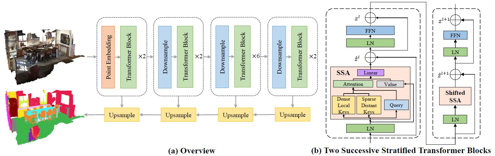

# Stratified Transformer for 3D Point Cloud Segmentation
*Xin Lai<sup>\*</sup>, Jianhui Liu<sup>\*</sup>, Li Jiang, Liwei Wang, Hengshuang Zhao, Shu Liu, Xiaojuan Qi, Jiaya Jia*

This is the official PyTorch implementation of our paper [**Stratified Transformer for 3D Point Cloud Segmentation**] that has been accepted to 2022 IEEE/CVF Conference on Computer Vision and Pattern Recognition (CVPR 2022).

<div align="center">
  
</div>

# Highlight 
1. Our method (Stratified Transformer) achives the state-of-the-art performance on 3D point cloud semantic segmentation on both S3DIS and ScanNetv2 datasets. It is the first time for point-based methods to outperforms voxel-based ones such as SparseConvNet and MinkowskiNet;
2. Stratified Transformer is point-based, and constructed via standard Transformer structure with multi-head self-attention, enjoying large receptive field, robust generalization ability as well as competitive performance;
3. This repository develops a memory-efficient implementation to combat the issue of variant-length tokens with several CUDA kernels, avoiding unnecessary momery occupation of the vacant tokens. We also use shared memory for further acceleration.

# Get Started

## Datasets Preparation

### S3DIS
Please refer to https://github.com/yanx27/Pointnet_Pointnet2_pytorch for S3DIS preprocessing. Then change the 'data_root' entry in the .yaml configuration file to your data path.

### ScanNetv2
Please refer to https://github.com/dvlab-research/PointGroup for the ScanNetv2 preprocessing. Then change the 'data_root' entry in the .yaml configuration file accordingly.

## Training
Run the following commands for training.

### S3DIS
- Stratified Transformer
```
python3 train.py --config config/s3dis/s3dis_stratified_transformer.yaml
```

- 3DSwin Transformer (The vernilla version shown in our paper)
```
python3 train.py --config config/s3dis/s3dis_swin3d_transformer.yaml
```

### ScanNetv2
- Stratified Transformer
```
python3 train.py --config config/scannetv2/scannetv2_stratified_transformer.yaml
```

- 3DSwin Transformer (The vernilla version shown in our paper)
```
python3 train.py --config config/scannetv2/scannetv2_swin3d_transformer.yaml
```

Note: It it normal to see the the results on S3DIS fluctuate between $\pm 0.5\%$ mIoU maybe because the size of S3DIS is relatively small, while the results on ScanNetv2 are relatively stable.

## Testing
For testing, first change the 'model_path', 'save_folder' and 'data_root_val' (if applicable) accordingly. Then, run the following command.
```
python3 test.py --config [YOUR_CONFIG_PATH]
```

## Pre-trained Models

For your convenience, you can download the pre-trained models and training/testing logs from [Here](https://mycuhk-my.sharepoint.com/:f:/g/personal/1155154502_link_cuhk_edu_hk/EihXWr_HEnJIvR_M0_YRbSgBV-6VEIhmbOA9TMyCmKH35Q?e=hLAPNi).


# Citation
If you find this project useful, please consider citing:

```
@inproceedings{lai2022stratified,
  title     = {Stratified Transformer for 3D Point Cloud Segmentation},
  author    = {Xin Lai, Jianhui Liu, Li Jiang, Liwei Wang, Hengshuang Zhao, Shu Liu, Xiaojuan Qi, Jiaya Jia},
  booktitle = {CVPR},
  year      = {2022}
}
```
